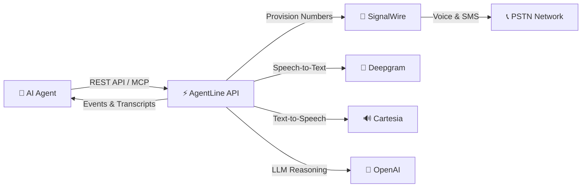

[](https://mseep.ai/app/agentlinehq-agentline)

<div align="center">
  
  <h1>AgentLine</h1>
  <p><strong>Open-source telephony API for AI agents — phone numbers, voice calls, and SMS</strong></p>
  <p>Give your AI agent a real phone number. Make outbound calls, receive inbound calls, and handle SMS — all through one API. No telecom expertise needed.</p>

  <br/>

  [](LICENSE)
  [](https://python.org)
  [](https://fastapi.tiangolo.com)
  [](https://modelcontextprotocol.io)
  [](Dockerfile)
  [](https://discord.gg/RmaJv8qHX)

  <br/>

  [Website](https://agentline.cloud) · [Docs](https://agentline.cloud/docs) · [Skill File](https://agentline.cloud/skill.md) · [Discord](https://discord.gg/RmaJv8qHX)

  <br/>
</div>

---

## What is AgentLine?

AgentLine is an **open-source AI-native telephony platform** that gives AI agents real phone numbers and human-like voices. It provides a simple REST API and MCP server so AI agents (Claude, Cursor, custom LLM agents) can make and receive phone calls, handle SMS, and retrieve transcripts — without any telecom knowledge.

```
Your AI Agent  →  AgentLine API  →  Real Phone Calls
                                 →  SMS Messages
                                 →  Call Transcripts
```

### Why AgentLine?

| | AgentLine | Twilio/Vonage | Build It Yourself |
|---|---|---|---|
| **Built for AI agents** | ✅ Purpose-built | ❌ Built for call centers | ❌ You stitch it together |
| **Setup time** | 5 minutes | Hours | Weeks |
| **MCP server** | ✅ Native | ❌ None | ❌ Build your own |
| **Skill file install** | ✅ One file | ❌ Complex SDK | ❌ Hundreds of lines |
| **Voice pipeline** | ✅ Included (STT + TTS + LLM) | ❌ BYO | ❌ BYO |
| **Open source** | ✅ MIT | ❌ Proprietary | ✅ Your code |

---

## Features

- 📞 **Voice Calls** — Make and receive real phone calls through a simple API
- 🎙️ **AI Voice Pipeline** — Built-in STT (Deepgram) + LLM (GPT-4o) + TTS (Cartesia) pipeline
- 💬 **SMS** — Receive and read inbound text messages
- 🔌 **MCP Server** — Native Model Context Protocol support for Claude Desktop and Cursor
- 📋 **Skill File** — One-file install for any AI agent (Claude Code, Cursor, OpenClaw)
- 🌍 **Multi-Provider** — SignalWire (US) with pluggable provider architecture
- 📝 **Transcripts** — Automatic call transcription with full conversation history
- 📬 **Event Mailbox** — Poll-based event system for agents without webhook endpoints
- 💰 **Built-in Billing** — Per-second call billing with balance tracking
- 🐳 **Docker Ready** — One command to run the entire stack locally

---

## Architecture



### Voice Pipeline — Hybrid Relay Mode

AgentLine uses an asynchronous **Hybrid Relay** architecture instead of fragile real-time WebSocket streams:

```
Caller dials your agent's number
  → SignalWire answers the call
  → Plays TTS greeting to caller
  → Records caller's speech
  → Deepgram transcribes (fast, accurate)
  → LLM generates agent response
  → Cartesia speaks the response
  → Loop continues until call ends
  → Full transcript stored for retrieval
```

---

## Quick Start

### Option 1: Docker Compose (Recommended)

```bash
git clone https://github.com/agentlineHQ/AgentLine.git
cd AgentLine
cp .env.example .env
# Fill in your API keys in .env (see Configuration below)
docker-compose up -d
```

This starts:
- **API server** at `http://localhost:8000`
- **PostgreSQL** at `localhost:5432` (schema auto-applied)
- **Redis** at `localhost:6379`

### Option 2: Local Development

```bash
git clone https://github.com/agentlineHQ/AgentLine.git
cd AgentLine
python -m venv venv
source venv/bin/activate  # or venv\Scripts\activate on Windows
pip install -r requirements.txt
cp .env.example .env
# Fill in your API keys
uvicorn agentline.main:app --reload
```

### Option 3: Use the Hosted Version

Skip self-hosting — sign up at [agentline.cloud](https://agentline.cloud) and get an API key instantly.

---

## Configuration

Copy `.env.example` to `.env` and fill in your credentials:

| Variable | Required | Description |
|----------|----------|-------------|
| `SUPABASE_URL` | Yes | Your Supabase project URL |
| `SUPABASE_ANON_KEY` | Yes | Supabase anonymous key |
| `SUPABASE_SERVICE_ROLE_KEY` | Yes | Supabase service role key (server-side) |
| `DATABASE_URL` | Yes | PostgreSQL connection string |
| `SIGNALWIRE_PROJECT_ID` | Yes | SignalWire project ID |
| `SIGNALWIRE_TOKEN` | Yes | SignalWire API token |
| `SIGNALWIRE_SPACE_URL` | Yes | Your SignalWire space URL |
| `DEEPGRAM_API_KEY` | Yes | Deepgram API key (STT) |
| `CARTESIA_API_KEY` | Yes | Cartesia API key (TTS) |
| `OPENAI_API_KEY` | Yes | OpenAI API key (LLM) |
| `REDIS_URL` | No | Redis URL (defaults to `localhost:6379`) |
| `SECRET_KEY` | Yes | App secret key |
| `BASE_URL` | Yes | Public URL of your deployment |

---

## API Reference

Once running, visit `http://localhost:8000/docs` for the interactive Swagger UI.

### Core Endpoints

| Method | Path | Description |
|--------|------|-------------|
| `POST` | `/v1/agents` | Create a new AI voice agent |
| `GET` | `/v1/agents` | List all agents |
| `PATCH` | `/v1/agents/{id}` | Update agent (prompt, voice, greeting) |
| `POST` | `/v1/numbers` | Provision a phone number |
| `GET` | `/v1/numbers` | List phone numbers |
| `POST` | `/v1/calls` | Make an outbound call |
| `GET` | `/v1/calls` | List calls |
| `GET` | `/v1/calls/{id}/transcript` | Get call transcript |
| `POST` | `/v1/calls/{id}/hangup` | End an active call |
| `GET` | `/v1/events` | Poll event mailbox (consume) |
| `GET` | `/v1/events/peek` | Peek at events (non-destructive) |
| `GET` | `/v1/messages` | List SMS messages |
| `GET` | `/v1/billing/balance` | Check account balance |
| `GET` | `/v1/billing/expenditure` | Spending breakdown |

### Authentication

All requests require an API key:

```bash
curl -H "Authorization: Bearer sk_live_YOUR_KEY" \
     -H "Content-Type: application/json" \
     https://api.agentline.cloud/v1/agents
```

---

## MCP Server Integration

AgentLine includes a built-in **MCP (Model Context Protocol) server**, so AI agents like Claude Desktop and Cursor can use telephony tools natively.

### Connect from Claude Desktop

Add to your Claude Desktop config:

**Windows:** `%APPDATA%\Claude\claude_desktop_config.json`
**macOS:** `~/Library/Application Support/Claude/claude_desktop_config.json`

```json
{
  "mcpServers": {
    "agentline": {
      "command": "npx",
      "args": [
        "-y", "mcp-remote@latest",
        "http://localhost:8000/mcp",
        "--header", "Authorization: Bearer sk_live_YOUR_KEY"
      ]
    }
  }
}
```

### Available MCP Tools

| Tool | Description |
|------|-------------|
| `create_agent` | Create a new AI voice agent |
| `list_agents` | List all agents |
| `update_agent` | Update agent config/prompt/voice |
| `make_outbound_call` | Initiate an outbound phone call |
| `list_calls` | List call history |
| `get_call_transcript` | Get the full transcript of a call |
| `hangup_call` | End an active call |
| `buy_phone_number` | Provision a new phone number |
| `list_phone_numbers` | List all phone numbers |
| `poll_events` | Poll event mailbox |
| `peek_events` | Peek at pending events |
| `get_account_balance` | Check account balance |
| `list_available_voices` | List voice presets |

### Test with MCP Inspector

```bash
npx @modelcontextprotocol/inspector http://localhost:8000/mcp
```

---

## Skill File — Install in 30 Seconds

AgentLine ships with a **skill file** that lets any AI agent gain telephony powers instantly:

```
https://agentline.cloud/skill.md
```

**How to use:**
1. Copy the skill URL above
2. Add it to your AI agent (Claude Code, Cursor, OpenClaw, etc.)
3. Set your `AGENTLINE_API_KEY` environment variable
4. Tell your agent: *"Call +1234567890"* — it just works!

The skill file is also included in this repo at [`skills/agentline/SKILL.md`](skills/agentline/SKILL.md).

---

## Tech Stack

| Component | Technology |
|-----------|-----------|
| **API Framework** | [FastAPI](https://fastapi.tiangolo.com) (async Python) |
| **Database** | PostgreSQL ([Supabase](https://supabase.com)) |
| **Cache** | Redis |
| **Phone Numbers & Calls** | [SignalWire](https://signalwire.com) |
| **Speech-to-Text** | [Deepgram](https://deepgram.com) Nova-2 |
| **Text-to-Speech** | [Cartesia](https://cartesia.ai) Sonic |
| **LLM** | [OpenAI](https://openai.com) GPT-4o / GPT-4o-mini |
| **MCP Server** | [FastAPI-MCP](https://github.com/tadata-org/fastapi-mcp) |
| **Deployment** | Docker, [Railway](https://railway.app) |

---

## Deployment

### Docker

```bash
docker build -t agentline .
docker run -p 8000:8000 --env-file .env agentline
```

### Any Cloud Provider

AgentLine runs anywhere that supports Python 3.12+ and Docker: AWS, GCP, Azure, Fly.io, Render, Railway, etc.

---

## Database Schema

The database schema is in [`schema.sql`](schema.sql). It creates tables for:

- **accounts** — User accounts with balance tracking
- **api_keys** — Hashed API keys for authentication
- **agents** — AI voice agent configurations
- **phone_numbers** — Provisioned phone numbers
- **calls** — Call records with transcripts
- **messages** — SMS message records
- **event_mailbox** — Server-side event queue
- **billing_ledger** — Immutable billing transaction log

Migrations are in the [`migrations/`](migrations/) directory.

---

## Pricing (Hosted Version)

If using the hosted version at [agentline.cloud](https://agentline.cloud):

| Item | Cost |
|------|------|
| Voice calls (inbound/outbound) | $0.10/min (billed per second) |
| Phone number | $2.00 (one-time) |
| SMS (inbound) | Free |

Self-hosted: you pay only your provider costs (SignalWire, Deepgram, Cartesia, OpenAI).

---

## Contributing

We welcome contributions! See [CONTRIBUTING.md](CONTRIBUTING.md) for guidelines.

- 🐛 **Bug reports** — [Open an issue](https://github.com/agentlineHQ/AgentLine/issues/new?template=bug_report.md)
- 💡 **Feature requests** — [Open an issue](https://github.com/agentlineHQ/AgentLine/issues/new?template=feature_request.md)
- 🔧 **Pull requests** — Fork, branch, PR

---

## Community

- 💬 [Discord](https://discord.gg/RmaJv8qHX) — Chat with the team and other builders
- 🐦 [Twitter](https://twitter.com/ovalpod94416) — Updates and announcements
- 📖 [Docs](https://agentline.cloud/docs) — Full API documentation
- 📝 [Blog](https://agentline.cloud/blogs) — Guides and tutorials

---

## License

[MIT](LICENSE) — use it for anything. Commercial use welcome.

---

<div align="center">
  <p>Built with ❤️ by the <a href="https://agentline.cloud">AgentLine</a> team</p>
  <p><sub>Give your AI agent a voice. ☎️</sub></p>
</div>
